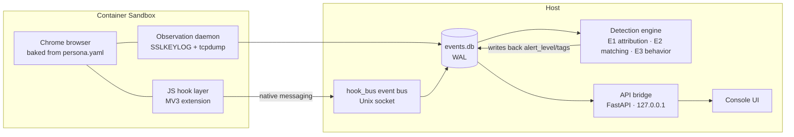

# Doppel（替身 Tishen）

**English** | [简体中文](./README.zh-CN.md)

> **The double is running. Nothing hides.**
> Run the web inside an isolated double of yourself — and watch everything the web tries to do to it.

[](https://github.com/evo-Vonish/Doppel/actions/workflows/ci.yml) [](#-quality-baseline) [](#-quality-baseline) [](#) [](#-roadmap) [](#-open-source--compliance)

**Doppel (codename *tishen*, 替身)** is a **local-first algorithmic browser** built from two complementary subsystems:

| Subsystem | What it does |
|---|---|
| **The Double (替身)** | Runs websites inside a local container sandbox baked with a complete, self-consistent identity — timezone, locale, fonts, GPU profile and Chrome fingerprint are all provisioned from spec. Websites see a clean Linux desktop *double* of you, never your real environment |
| **Panopticon (无所遁形)** | Maximizes visibility into web page behavior: who stores which cookie, calls which fingerprinting API, sends what data to whom — with script attribution and a full evidence chain. A detection engine scores and alerts on tracking, fingerprinting and cryptomining |

**Design philosophy**: *Don't lie — build the real thing.* We never patch browser APIs (patching introduces contradictions that detectors can find); we build genuinely coherent environments from scratch. Observation is passive (TLS key export + packet capture) — the network path stays strictly read-only.

## ✦ Features

- **Spec-driven**: one declarative `persona.yaml` drives both environment baking and the monitoring baseline — any deviation from spec is an alert
- **Three-layer detection engine**: entity attribution (domain→entity dataset) × request matching (ABP rule engine, 96.6% EasyPrivacy coverage) × behavioral heuristics (mining/fingerprinting scorers). **A single suspicious API call never triggers a high-severity alert** — level 3 requires multiple independent signals plus a ≥3-site cross-site gate
- **Four-layer cryptomining defense**: behavioral scoring (incl. academically-proven stack-based signals that cannot be evaded) → L2 payload confirmation (static analysis + WASM instruction fingerprints) → L3 visibility canaries → generic malicious-JS coverage
- **JS hook layer**: an in-container MV3 extension reports six script-side event types (api_call / worker_spawn / wasm_load / storage_write / block_action / visibility_probe) via native messaging — observation never interferes with the page, zero CDP (no detectable traces)
- **Adversarial testing**: CLR (Consistency Leak Rate) = 0 as the north-star metric, with an 82-item cross-layer consistency checklist (CreepJS / sannysoft / BrowserLeaks / incolumitas / self-developed)
- **Full evidence chain**: every alert traces back to rule ids, entities, behavioral signals and encrypted payload shards
- **Console UI**: precision-instrument design (React 19 + Vite 7 + Tailwind + shadcn/ui), dual-density modes (default / expert)

## ✦ Architecture



## ✦ Repository Layout

```
core/tishen/          # Python core
  ├── cli.py          # orchestration CLI (create/start/stop/lint/doctor/...)
  ├── persona.py      # persona.yaml spec & validation
  ├── linter.py       # factory gate V1–V10
  ├── observ/         # observation pipeline (keylog/decrypt/event store/daemon/hook_bus)
  ├── engine/         # detection engine (entity/rules/behavior/scorer/daemon/payload/datasets)
  ├── adversarial/    # R-Gate + CLR checklist v1.1 (82 items)
  ├── resbench/       # resource baseline (sampling/boot timing/sleep fidelity/report)
  └── api/            # local API bridge (FastAPI, 11 endpoints)
image/                # container image: Dockerfile + persona_bake + hook layer + MV3 extension
tools/adversarial/    # CreepJS self-hosting + probe harness
pipeline/ shell/      # build & ops scripts
```

## ✦ Quick Start

```bash
# Dev-mode verification (no Docker required)
python -m pytest core/tests -q          # 479 passed
cd image/hook && node --test test/      # 25 passed

# Real-machine run (Linux, or Windows WSL2 + Docker)
python core/tishen/cli.py create        # create a persona
python core/tishen/cli.py start <id>    # start it (neko WebRTC display)
python core/tishen/cli.py events <id>   # watch the behavior event stream
```

Real-machine acceptance runs follow the *Real-Environment Acceptance Manual* and the *Field-Verification Handoff* documents (handoff doc pack).

## ✦ Quality Baseline

- **pytest 479/479**: orchestration / persona / gate / observation / API bridge / M4 / M5 / detection engine / hook — reproducible in a clean `env -i` shell
- **node --test 25/25**: hook interception surface, non-interference guarantees, adaptive sampling, event protocol
- Contract testing throughout: 19 API-bridge cases, frontend/backend types kept in sync, cross-language protocol smoke tests

## ✦ Roadmap

- [x] M1–M3: container orchestration / neko display skeleton / observation pipeline (sandbox-verified)
- [x] M4/M5 toolchains: adversarial testing / resource baseline (real-machine runs pending)
- [x] Detection engine + hook layer: full Panopticon data path closed
- [ ] **Field verification window**: compatibility-matrix acceptance (A1–A8) + M4/M5 measurements (~9 person-days)
- [ ] Productization P1: multi-persona scheduling (semi-auto), one-shot installer, evidence export (decisions locked, gated on field verification)

## ✦ Open Source & Compliance

- **Defensive-privacy positioning**: no identity-document generation; **no CAPTCHA/risk-control bypass capabilities** (adversarial tests measure, never evade)
- **Local-first**: all computation and data stay on your machine, zero telemetry; monitoring data is encrypted locally, one-click erasable, and destroyed with the container
- **License TBD**: data assets are tiered — the core path depends only on non-NC sources (EasyPrivacy / whoTracks.me, CC BY 4.0); Tracker Radar / TrackerDB (CC BY-NC-SA) ship as optional non-commercial data packs with independent toggles. Formal license and NOTICE will land with the open-source-strategy decision

---

*Doppel (替身) — a clean double of yourself, and nowhere for trackers to hide.*
