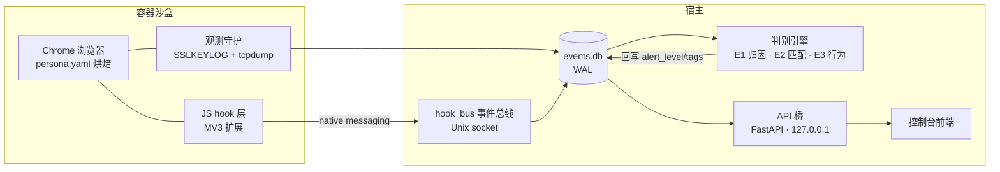

# Doppel（替身 Tishen）

> **替身已启动，目标无所遁形。**
> Run the web inside an isolated double of yourself — and watch everything the web tries to do to it.

[](#-质量基线) [](#-质量基线) [](#) [](#-路线图) [](#-开源与合规)

**Doppel（代号 tishen，替身）** 是一套**本地优先的算法浏览器系统**，由两个互为表里的子系统组成：

| 子系统 | 一句话职责 |
|---|---|
| **替身** | 让网页跑在预置好完整身份环境的本地容器沙盒里——时区、locale、字体、GPU、Chrome 指纹全部按规格烘焙且跨层自洽，网站拿到的是一套干净的 Linux 桌面分身数据，而非你的真实环境 |
| **无所遁形** | 最大化网页行为可见性：谁在何时存了什么 Cookie、调用了什么指纹 API、把什么数据发给了谁——附脚本归因与证据链；判别引擎对追踪、指纹采集与挖矿脚本分级告警 |

**设计哲学**：不撒谎，直接造真的。不篡改浏览器 API（篡改引入的矛盾可被检测），而是从头构建真实自洽的浏览环境。观测走旁路（TLS 密钥导出 + 抓包解密），网络链路永远只读。

## ✦ 特性

- **规格驱动**：一份声明式 `persona.yaml` 同时驱动替身环境烘焙与监测基线，任何偏离规格的行为即为警报
- **三层判别引擎**：实体归因（域名→实体底表）× 请求匹配（ABP 规则引擎，EasyPrivacy 支持率 96.6%）× 行为启发式（挖矿/指纹双评分器）——**单个可疑 API 调用永不触发高级告警**，级别 3 必须多信号交叉 + 跨站 ≥3 闸门
- **挖矿检测四层防线**：行为评分（含学术实证不可规避的 stack-based 信号）→ L2 载荷确认（静态分析 + WASM 指令指纹）→ L3 可见性金丝雀 → 通用恶意 JS 扩展
- **JS hook 层**：容器内 MV3 扩展经 native messaging 回传六类脚本事件（api_call/worker_spawn/wasm_load/storage_write/block_action/visibility_probe）——观测不干预页面，零 CDP（不引入可检测痕迹）
- **对抗测试体系**：CLR（自洽性露馅率）= 0 北极星指标，82 条跨层一致性清单（CreepJS/sannysoft/BrowserLeaks/incolumitas/自研五来源）
- **证据链完整**：每条告警可溯源到规则 id、实体、行为信号与加密载荷分片
- **控制台前端**：精密仪器控制台设计（React 19 + Vite 7 + Tailwind + shadcn/ui），双模式密度（普通/专家）

## ✦ 架构



## ✦ 仓库结构

```
core/tishen/          # Python 核心
  ├── cli.py          # 编排 CLI（create/start/stop/lint/doctor/...）
  ├── persona.py      # persona.yaml 规格与校验
  ├── linter.py       # 出厂门禁 V1–V10
  ├── observ/         # 观测流水线（keylog 对齐/解密/事件库/daemon/hook_bus）
  ├── engine/         # 判别引擎（entity/rules/behavior/scorer/daemon/payload/datasets）
  ├── adversarial/    # R-Gate + CLR 清单 v1.1（82 条）
  ├── resbench/       # 资源基线（采样/启动计时/休眠保真/报告）
  └── api/            # 本地 API 桥（FastAPI 11 端点）
image/                # 容器镜像：Dockerfile + persona_bake + hook 层 + MV3 扩展
tools/adversarial/    # CreepJS 自托管 + 探针采集 harness
pipeline/ shell/      # 构建与运维脚本
```

## ✦ 快速开始

```bash
# 开发态验证（无需 Docker）
python -m pytest core/tests -q          # 479 全绿
cd image/hook && node --test test/      # 25 全绿

# 真机运行（需要 Linux 或 Windows WSL2 + Docker）
python core/tishen/cli.py create        # 创建替身
python core/tishen/cli.py start <id>    # 启动（neko WebRTC 回显）
python core/tishen/cli.py events <id>   # 查看行为事件流
```

真机核验流程见《真实环境验收手册》与《真机核验 Handoff》文档（handoff 文档包）。

## ✦ 质量基线

- **pytest 479/479**：编排/persona/门禁/观测/API 桥/M4/M5/判别引擎/hook 全模块（`env -i` 干净环境可复现）
- **node --test 25/25**：hook 拦截面、观测不干预、采样自适应、事件协议
- 契约测试贯穿：API 桥 19 用例、前后端类型同源、跨语言协议串通冒烟

## ✦ 路线图

- [x] M1–M3：容器编排 / neko 回显骨架 / 观测链路（沙盒验证完成）
- [x] M4/M5 工具链：对抗测试 / 资源基线（真机采集待执行）
- [x] 判别引擎 + hook 层：无所遁形数据通路全链闭合
- [ ] **真机窗口期**：四格矩阵验收（A1–A8）+ M4/M5 实测（约 9 人日）
- [ ] 产品化 P1：多替身调度（半自动）、一体化安装包、证据导出（决策已定，受真机门禁）

## ✦ 开源与合规

- **防御性隐私定位**：不生成身份资料；**不内置任何绕过验证码/风控的能力**（对抗测试只测量不绕过）
- **本地优先**：全部计算与数据留在本机，零遥测；监测数据本地加密、可一键清除、随容器销毁
- **License 待定**：数据资产分两级——核心路径仅依赖非 NC 源（EasyPrivacy / whoTracks.me，CC BY 4.0），Tracker Radar / TrackerDB（CC BY-NC-SA）为可选非商业数据包、独立开关。正式 License 与 NOTICE 将于开源策略裁定时落定

---

*Doppel（替身）——隔离出一个干净的自己，让追踪者无所遁形。*
